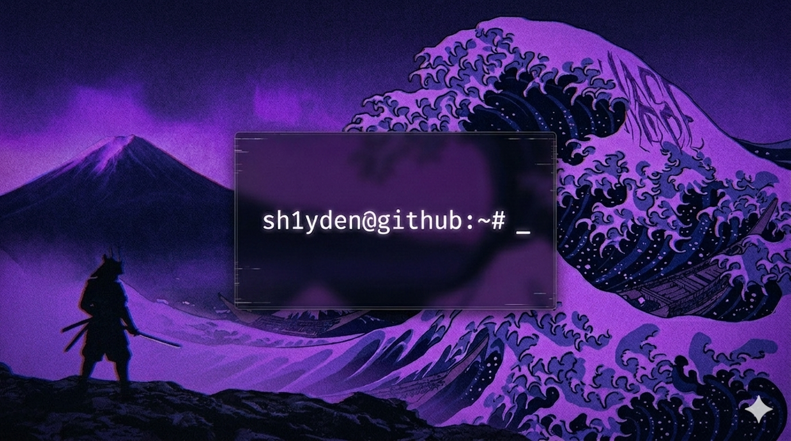

```bash
sh1yden@dev-environment:~# cat profile.json
```

```json
{
  "identity": {
    "nickname": "Shayden / Sh1yden",
    "name": "Kirill",
    "specs": {
      "age": 18,
      "location": "Russia 🇷🇺, Kusrk",
      "hobbies": [
        "Music 🎵",
        "Cycling 🚲",
        "Gaming 🎮",
        "Watching Series & Films 🎥",
        "Traveling 🚗",
        "Reading 📚"
      ]
    }
  },
  "stack": {
    "languages": ["Python 🐍", "Java ♨️", "JavaScript JS", "SQL 🗄️"],
    "frameworks": [
      "Asyncio",
      "Aiohttp",
      "Aiogram 🤖",
      "FastAPI 🚀",
      "Pydantic",
      "Django DJ",
      "SQLAlchemy 🏗️"
    ],
    "databases": ["PostgreSQL 🐘", "SQLite 🔋", "Redis 💾"]
  },
  "environment": {
    "os": "Windows 11 & Arch Linux 🐧",
    "tools": ["Docker 🐳", "Obsidian 📓", "Git 🌿"],
    "daily_driver": "WSL 2 💻"
  },
  "active_work": {
    "projects": [
      {
        "name": "SkyNode",
        "description": "SkyNode is your personal weather hub. 🌩",
        "url": "https://github.com/Sh1yden/SkyNode"
      },
      {
        "name": "LinkCutter",
        "description": "LinkCutter",
        "url": "https://github.com/Sh1yden/LinkCutter"
      },
      {
        "name": "Axis",
        "description": "???",
        "url": "???"
      }
    ]
  }
}
```

```shell
[ ⚡ Master ]--[ 📂 ~/projects/profile ]--[ 🐍 Python 3.14 ]
```

# 📊 GitHub Stats

<table border="0">
<tr border="0">
<td width="50%" align="center">

</td>

<td width="50%" align="center">


</td>
</tr>
</table>

## 🐍 My Contributions

<picture>
  <source media="(prefers-color-scheme: dark)" srcset="https://raw.githubusercontent.com/sh1yden/sh1yden/output/github-contribution-grid-snake-dark.svg">
  <source media="(prefers-color-scheme: light)" srcset="https://raw.githubusercontent.com/sh1yden/sh1yden/output/github-contribution-grid-snake.svg">
  
</picture>
